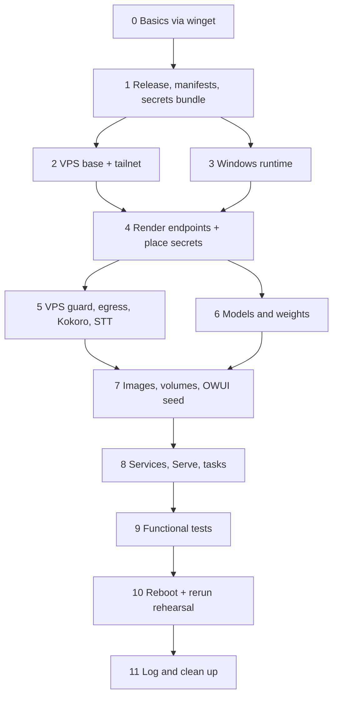

# 🦙 ollama-cria

**Disaster recovery for Liam's Open WebUI, Ollama and ComfyUI stack.** A *cria* is a baby llama: this repo grows a new copy of the stack from nothing.

> **Starting point:** two brand-new machines (a Windows 11 PC and an Ubuntu 24.04 VPS). Only GitHub, Bitwarden and Liam's accounts survive.
> **End point:** the same capabilities as today: models, tools, MCP servers, functions, skills, presets, settings, Serve rules and the VPS web egress. Chat history and old uploads are deliberately not restored.

| | |
|---|---|
| **The guide** | [`docs/RESTORE.md`](docs/RESTORE.md) (v0.3, ledger `AICL-0132`) |
| **Status** | 🚧 Being built module by module. Nothing here has been run against a real rebuild yet. |
| **Secrets** | **None in this repo, ever.** They travel in one bundle kept in Bitwarden. CI scans every file. |
| **Checks** | Claude builds and reviews its own work before every push; CI runs every test on Windows and Linux; Liam signs off anything that runs against the live machines. (External review rounds ended on 6 October 2026.) |

---

## 🗺️ How a rebuild flows



Every stage ends with a 🛑 checkpoint that must pass before the next one starts. The full detail is in [`docs/RESTORE.md`](docs/RESTORE.md).

---

## 🧱 Modules

Built in this order: the **capture side first**, because a restore script can be written on a new machine after a disaster, but the secrets bundle and the OWUI seed can only be made from the machine that still works.

| # | Module | What it does | Status |
|---|---|---|---|
| 1 | `tools/Test-RecoveryPath.ps1` | The one path check every stage uses before it writes, copies, extracts or deletes anything | ✅ |
| 1 | `manifests/schemas/restore-map.schema.json`, `manifests/recovery-roots.json`, `tools/Test-RestoreMap.ps1` | The versioned restore-map format the collector writes and the restorer reads | ✅ |
| 1 | `tools/Test-NoSecrets.ps1` | CI guard: refuses secret-shaped strings, private addresses and forbidden files | ✅ |
| 2 | `manifests/secrets.json`, `manifests/bundle-folders.json` | The secret inventory (names and logical locations only, never values) and which root each bundle folder restores to | ✅ |
| 2 | `tools/Collect-StackSecrets.ps1` | Rewritten collector: plans offline by default; with `-Execute` builds a protected bundle, its restore map and the ZIP | ✅ |
| 3 | `tools/Export-OwuiSeed.py`, `manifests/owui-seed/schema.json` | OWUI functional seed exporter, run inside the OWUI container: one read-only snapshot, an allowlist where anything unknown stops the export, Valves decrypted with OWUI's own codec, secrets moved to references for bundle folder 03 | ✅ |
| 4 | `tools/Collect-StackSecrets.ps1` (seed row), `manifests/owui-seed/seed/` | The real capture in one run: the collector also exports the OWUI seed through `docker exec -i`, puts its secrets in bundle folder 03, scans the seed and writes it here for committing | 🚧 |
| 5 | `tools/Restore-StackSecrets.ps1` | Checks the bundle's SHA-256, unpacks it into a protected folder, checks it against the inventory, and puts each chosen bundle folder back: PC files owner-only, VPS files over ssh with their mode, volume files through a helper container. Never overwrites | 🚧 |
| 5 | `tools/Import-OwuiSeed.py` | OWUI seed importer, run with OWUI stopped: fills secret references and embedded secrets from folder 03, renders the new addresses, points every owner at the new admin, re-encrypts Valves with OWUI's own code, all in one transaction | 🚧 |
| 6 | `manifests/stack-files.json`, `tools/Sync-StackFiles.ps1`, `tools/StackCapture.psm1` | Copies the stack's own files (compose, Dockerfiles, bridges, scripts, the dashboard, the VPS egress, Kokoro, nginx and systemd files) from the live PC and VPS into `stack/`, `extras/`, `vps/` and `windows/startup/`. Tailnet addresses become placeholders, every file is scanned before it lands, and `manifests/endpoints.json` lists what each file needs filled in | 🚧 |
| 6 | `tools/Sync-StackManifests.ps1`, `manifests/schemas/*` | Reads the rest of Appendix B from the live machines: Ollama models and their Modelfiles, the Ollama profile, winget apps and the GPU driver, ComfyUI and node commits with a pip lock, weights with SHA-256 and checked download URLs, Serve rules, scheduled tasks as templated XML, and the image behind every container | 🚧 |
| 7+ | Stage modules and the controller | `Invoke-StackRecovery.ps1`, `windows/stages/*`, `linux/stages/*` | ⏳ |

Status key: ✅ built, tests green on Windows and Linux · 🚧 in progress · ⏳ not started.

---

## 🧪 Running the tests

Needs PowerShell 7.4+ and Pester 5.

```powershell
Install-Module Pester -MinimumVersion 5.5 -Scope CurrentUser   # once
Invoke-Pester ./tests -Output Detailed
./tools/Test-NoSecrets.ps1                                      # the same scan CI runs
python -m unittest discover -s tests/python -v                 # the seed exporter and importer (Python 3.11, standard library only)
```

CI runs all three on Windows and Linux for every push and pull request. The collector's VPS tests use stand-ins for `ssh` and `scp` (`tests/fakes/`) and run on Linux only; its volume tests need a Linux Docker engine, so they run on the Linux runner and are skipped elsewhere. The seed exporter's tests use a stand-in for OWUI's Valve codec (`tests/python/fake_owui/`) and a fake OWUI 0.11.4 database built at run time. The collector's seed tests run the real exporter through stand-ins for `docker` and `tailscale`, so they need Python on the path. The restorer's tests restore bundles the real collector made; its VPS tests run the real remote script through the `ssh` stand-in on Linux, and its volume tests use the Linux Docker engine. The importer's tests export a fake old install, import it into a fake fresh one, and export that again to prove the round trip. The two Module 6 tools run against stand-ins for `tailscale`, `docker`, `ssh`, `python`, `winget` and `nvidia-smi`, and Pester mocks for the Ollama, Hugging Face and Civitai APIs; their task and app tests run on Windows only.

---

## 🔒 Rules for everyone (people and assistants)

1. **No secret values** in code, tests, fixtures, docs, commit messages or logs. Tests build fake secrets at run time; they are never written into a file.
2. **No private addresses.** Tailnet IPs and hostnames are templated (`{{PC_TS_IP}}`, `{{VPS_TS_IP}}`).
3. **Nothing runs for real** against the live PC or VPS until Liam signs off the register in `docs/RESTORE.md` Appendix C.
4. **Every change is logged** in the stack's ledger (`AI-CHANGELOG.csv` on the PC) with its `AICL` id.
5. Where the guide and the live machine disagree, **the live machine is right**: fix the guide.
