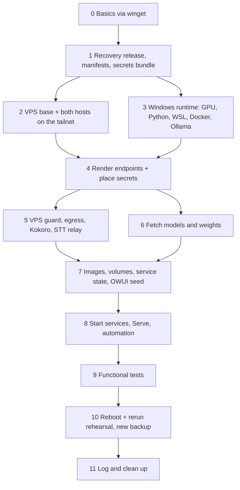

# 🛟 Stack Rebuild Guide

**Clean deployment of the PC (Windows 11) and VPS (Ubuntu) · Open WebUI, Ollama, ComfyUI, MCP tools and the Mullvad web egress**

> **Goal:** two brand-new machines end up with the same capabilities you have today: the same models, tools, MCP servers, functions, skills, model presets, settings, routes and automation. Chat history and old uploads are deliberately **not** restored.
> **Run it top to bottom.** Every stage says what it delivers, where it runs, and the checkpoint that must pass before the next stage starts.

| | |
|---|---|
| **Version** | DRAFT v0.3, 5 October 2026 (v0.1 kept as `RESTORE-v0.1.md`) |
| **Author** | Claude |
| **Ledger** | AICL-0122 (plan) · AICL-0123 to AICL-0125 (round one) · AICL-0126 (v0.2) · AICL-0127, AICL-0131 (Liam's decisions) · AICL-0129, AICL-0130 (round two) · this revision's row |
| **Verification** | ☐ ChatGPT (adversarial review) · ☐ Antigravity (on-machine check) · ☐ Liam (sign-off) |
| **Status** | Design document. Nothing in it has been executed. No stage module exists yet unless marked ✅. Next step (Liam, 5 Oct): **build `ollama-cria` module by module**, each rehearsed on a throwaway target. |

### 🔄 What changed in v0.3

| Change | Why |
|---|---|
| Docker's guard drop-in is restored with the guard (Stage 5a) | C-43, live on the VPS |
| OWUI user settings travel in the seed as an allowlisted projection (Stage 7d) | C-37 |
| Every owner and member reference is remapped, not only tools and functions (Stage 7d) | C-38 |
| Local images are built **before** any container exists; OWUI's schema starts with `--no-deps` (Stage 7a, 7d) | C-36 |
| The seed exporter uses OWUI's own Valve codec, an allowlist schema and the recorded OWUI version (Stage 7d) | C-39, C-40, C-41 |
| The secrets bundle is downloaded at the end of Stage 1, so Stage 2 has the SSH key (Stage 1) | C-35 |
| One path-check helper guards every restore, fetch and clean-up (Controller, Stage 11) | C-44, C-49 |
| Interrupted stages wipe only what the controller owns and rerun (Controller) | C-45, simplified |
| A changed model digest pauses for Liam instead of failing silently (Stage 6a) | C-48, simplified |
| Stage 9 runs one acceptance row per capability (`acceptance.json`) | C-46 |
| A monthly owner checkpoint keeps the bundle and seed current (Stage 10) | C-47 |
| **Discord bridge retired** (Liam, `AICL-0131`): bridge, `discord_feed_curator` pipe, `#announcements` channel and webhook are out of scope | Owner decision |
| **`OWUI-Automation-Chat-Tidy` retired**: failing daily with 401, its automations are gone | C-51, R-20 |
| The Groq STT relay holds no secret; bundle folder 06 is removed | C-25, checked live |

---

## 📖 How to read this guide

**Where each step runs**

| Icon | Meaning |
|---|---|
| 🖥️ | PC, PowerShell 7 (`pwsh`). "Admin" means an elevated window. |
| ☁️ | VPS, **bash**, reached with `ssh vps` once Stage 2 has set it up |
| 🔐 | Needs Bitwarden |
| 👤 | A human step: Liam does it by hand |
| 🤖 | An AI step: Claude, Antigravity or ChatGPT runs or checks it |

**Status tags**

| Tag | Meaning |
|---|---|
| ✅ | Exists today at the path given |
| ♻️ | Exists today, but must be refactored before it is used (the finding ID says why) |
| 🛠️ | To build. The guide gives the manual equivalent until it exists |
| ❓ | Open item with an ID in [Appendix C](#appendix-c--register). Resolve it, never guess |

**Checkpoints.** Every stage ends with a 🛑 **Checkpoint** table. The controller stops there, prints the evidence, and waits for the named checker to type `continue`. A failed check stops the run; it never "warns and carries on".

---

## 🧭 What "clean deployment" means here

| Comes back (capability) | Does not come back (content) |
|---|---|
| ✅ Every Ollama model, with the same tags and the custom Modelfiles | ❌ Chats (97 today, all test data) |
| ✅ Every ComfyUI model, custom node and workflow | ❌ Uploaded files (218 rows today, few real uploads) |
| ✅ OWUI settings (the 409-row `config` table), with credentials re-injected | ❌ Notes, the single memory entry, automation run history |
| ✅ 15 tools, 5 functions, 21 skills, 33 model presets, 5 prompts | ❌ Calendar events cached in OWUI (they re-sync from Google) |
| ✅ 18 tool-server connections (16 through `mcpo-core`, plus Gmail and Calendar bridges) | ❌ Generated images and video |
| ✅ Your OWUI user settings: pinned models, tool settings, the sub-agent prompt, TTS choices | ❌ Logs and caches |
| ✅ Groups and access grants | ❌ 🗄️ Retired: Discord bridge, its pipe, channel and webhook; `OWUI-Automation-Chat-Tidy` |
| ✅ Microservices: Tika, Playwright MCP, mcpo, the gcal and Gmail bridges, ntfy, Bolt, Dozzle, open-terminal, dashboard | |
| ✅ VPS web egress through gluetun/Mullvad, the guard, Kokoro and the STT relay | |
| ✅ Tailscale Serve rules, scheduled tasks and the ComfyUI logon launcher | |

**The rule that makes this safe:** OWUI's capability state is installed from a sanitised **functional seed** kept in the recovery repo. The seed holds no secrets and no ciphertext, only references; the controller fills them from Bitwarden. A copied `webui.db` is never committed and never used as the seed.

**📌 Decisions already made by Liam:** clean deployment · repo `ollama-cria` · `OLLAMA_KEEP_ALIVE=45s` · no extra archive encryption (BitLocker plus an owner-only folder is the protection) · secrets bundle in **Bitwarden only** · Kokoro on the VPS · Discord bridge retired · build next, rather than another paper review.

---

## ✅ Prerequisites (the only manual set-up)

| # | You need | How to check |
|---|---|---|
| P1 | Windows 11, fully updated, signed in as the user who will own the stack | Settings → Windows Update shows "You're up to date" |
| P2 | PowerShell 7 | `pwsh -v` prints 7.4 or later (7.6.6 today) |
| P3 | winget | `winget --version` prints a version (v1.29 today) |
| P4 | A wiped VPS running **Ubuntu 24.04 LTS**, with provider-console access | The provider console shows the server and its root login |
| P5 | 🔐 Bitwarden account, master password and 2FA | You can sign in at vault.bitwarden.com |
| P6 | GitHub account with access to the private recovery repo | You can open the repo in a browser |
| P7 | Tailscale account (the same tailnet) | You can open the admin console |
| P8 | Disk: an NVMe drive for `E:` with at least 400 GB free, BitLocker on | `manage-bde -status E:` shows "Protection On" |

> 💡 **Why Ubuntu 24.04 and not 26.04?** The live VPS runs 24.04.5 and the stack is proven there. 26.04 can be trialled later behind a clean-host test (C-33).

---

## Step 0 · Install the basics with winget 👤

> **Delivers:** a browser, Tailscale, Git, Bitwarden and the three assistants, so everything after this can be automated
> **Where:** 🖥️ PowerShell 7, Admin
> **Module:** 🛠️ `bootstrap\Install-Baseline.ps1` (the commands below are its whole content)

Every ID below was checked with `winget search` and `winget show` on 5 October 2026.

```powershell
$apps = @(
  @{ Id = 'Mozilla.Firefox';      Source = 'winget'  }   # or Google.Chrome
  @{ Id = 'Tailscale.Tailscale';  Source = 'winget'  }
  @{ Id = 'Git.Git';              Source = 'winget'  }
  @{ Id = 'Bitwarden.Bitwarden';  Source = 'winget'  }
  @{ Id = 'Anthropic.Claude';     Source = 'winget'  }
  @{ Id = '9PLM9XGG6VKS';         Source = 'msstore' }   # ChatGPT, publisher OpenAI
  @{ Id = 'Google.Antigravity';   Source = 'winget'  }
)
foreach ($a in $apps) {
  winget list --id $a.Id --exact --source $a.Source --accept-source-agreements *> $null
  if ($LASTEXITCODE -eq 0) { "already installed: $($a.Id)"; continue }      # safe to run twice
  winget install --id $a.Id --exact --source $a.Source --accept-package-agreements --accept-source-agreements
  if ($LASTEXITCODE -ne 0) { throw "winget failed for $($a.Id) (exit $LASTEXITCODE)" }
}
# Pick up the new commands (git, tailscale) in this window without reopening it
$env:Path = [Environment]::GetEnvironmentVariable('Path','Machine') + ';' + [Environment]::GetEnvironmentVariable('Path','User')
```

If an installer asks for a reboot, reboot and run the script again; finished packages are skipped (C-53).

Then, by hand:

1. In the Tailscale admin console, **remove the old, dead PC node first**, so the new PC can take the same name without a `-1` suffix (C-22). Then sign in to Tailscale. **Don't** run `tailscale serve` yet; Stage 8 does that.
2. Sign in to Bitwarden, GitHub (in the browser), Claude, ChatGPT and Antigravity.
3. Give Claude or Antigravity access to `E:\` so it can drive the rest.

🛑 **Checkpoint 0**

| Who | Check | Expected |
|---|---|---|
| 👤 | `tailscale status` | This PC is listed and online |
| 👤 | `git --version` | A version prints |
| 👤 | Each assistant opens and is signed in | Yes |

> 🧯 **If a Store install fails** (ChatGPT comes from `msstore`), install it from the Microsoft Store app instead. It is the only package in this list that is not on the winget source.

---

## 🗺️ The shape of it



**Order rules**

- Nothing that writes data starts before Stage 7 has created its volumes and state. That stops an empty OWUI or ntfy from initialising itself in the wrong shape (C-13).
- Every local image is built before any container is created (C-36).
- The VPS is built before anything on the PC needs it (C-02).
- Stages 3 and 6 are long and independent of the VPS, so the controller can run them while Liam handles VPS console steps.

---

## 🎛️ The controller

> **Module:** 🛠️ `Invoke-StackRecovery.ps1`, at the root of the recovery repo

```powershell
pwsh -File .\Invoke-StackRecovery.ps1 -Plan           # print every stage and what it would do; touch nothing
pwsh -File .\Invoke-StackRecovery.ps1                 # run from the first unfinished stage
pwsh -File .\Invoke-StackRecovery.ps1 -Stage 5        # run one stage (its prerequisites must already be done)
pwsh -File .\Invoke-StackRecovery.ps1 -Resume         # carry on after a reboot or a stop
```

| Behaviour | Rule |
|---|---|
| State file | `E:\recovery-state\state.json`. Records each stage, its result, the release commit and manifest hashes. **No secrets, ever.** |
| Resume | A finished stage is skipped only after its checkpoint is re-validated. A reboot-required flag resumes the same stage. |
| Ownership | Every folder, file and volume the controller creates is recorded as **owned** in the state file. If a stage is interrupted, the controller wipes only what that stage owns and runs the stage again. It never deletes or overwrites anything it did not create (C-45). |
| Paths | One helper, 🛠️ `tools\Test-RecoveryPath.ps1`, checks every path before anything is written, copied, extracted or deleted. It must resolve inside a configured root; it rejects `..`, absolute paths in archives, links or junctions that escape, alternate data streams, device names and case-only duplicates (C-44, C-49). |
| Failure | Any failed command throws. The stage is marked `failed`, the evidence is kept, and the run stops. Exit code is non-zero. |
| Elevation | The controller asks for Admin once at the start, passes every non-secret parameter through, and returns the child's exit code (C-14). |
| Secrets | Never in arguments, URLs, transcripts or the state file. Read from the protected staging folder only (C-14, C-05). |
| Evidence | Metadata only: names, counts, hashes, exit codes and HTTP status. Stages that touch secrets keep no transcript; native error text goes through a redaction step that is tested with fake secrets before first use (C-50). |
| VPS stages | The PC copies `linux\stages\*.sh` to the VPS and runs them with `ssh vps 'bash -euo pipefail …'`. Their output comes back as evidence. |

---

# STAGE 1 · Recovery release, manifests and the secrets bundle

> **Delivers:** the recovery repo on disk, validated manifests, the target folders, a protected staging folder, and the secrets bundle checked and unpacked inside it
> **Where:** 🖥️ PowerShell 7
> **Module:** 🛠️ `windows\stages\01-release.ps1`

1. Clone the repo with Git Credential Manager (browser sign-in). **Never** put a token in the URL (C-14).
   ```powershell
   git clone https://github.com/<owner>/ollama-cria.git E:\recovery
   git -C E:\recovery checkout <release-tag>
   ```
2. Validate every manifest in `E:\recovery\manifests\` against its schema (Appendix B lists them).
3. Create the target roots from `manifests\topology.json`:

   | Root | Holds |
   |---|---|
   | `E:\ai\ollama` | The stack: compose file, Dockerfiles, bridge source, scripts. Copied from `stack\` in the repo. |
   | `E:\ai\ag-startuip\cline-dashboard` | Homelab dashboard source (its own compose project) |
   | `E:\ai\ollama\gmail-owui-bridge` | Gmail bridge (its own compose project) |
   | `E:\ai\comfyui\ComfyUI` | Native ComfyUI (Stage 3 clones it) |
   | `E:\ollama-models` | Ollama model store |
   | `E:\ai\generated` | OWUI generated media bind mount |
   | `E:\ai\OpenFolders\workspace`, `E:\ai\OpenFolders\mcp\intel` | open-terminal and MCP bind mounts (created empty) |

4. Create the protected staging folder `E:\recovery-secrets\` **with a restrictive ACL from birth**: owner and only grant = the current user's SID, inheritance off. Then read the ACL back and fail if anything else has access (C-04, C-05).
5. 🔐👤 **Download the bundle** (moved here from Stage 4 so Stage 2 has the SSH key, C-35). In Bitwarden, save `stack-secrets-<date>.zip` **straight into** `E:\recovery-secrets\`, never `Downloads`. The controller checks its SHA-256 against the value stored in the same Bitwarden item, checks every member path with `Test-RecoveryPath`, then extracts it in place. The ZIP, any partial download and the extracted files all stay inside the protected folder.
6. 🤖 **Place the SSH key and config now.** The private key, its `.pub` and `~\.ssh\config` (bundle folder 04) go to `%USERPROFILE%\.ssh\` with owner-only ACLs. The `vps` alias is re-pointed to the new server's name in Stage 2c.

🛑 **Checkpoint 1**

| Who | Check | Expected |
|---|---|---|
| 🤖 | `git -C E:\recovery describe --tags` | The intended release tag |
| 🤖 | Manifest validation | Every manifest passes |
| 🤖 | `(Get-Acl E:\recovery-secrets).Access` | Exactly one entry: the current user, Full Control |
| 🤖 | `manage-bde -status E:` | Protection On |
| 🤖 | Bundle SHA-256 vs the value in Bitwarden | Identical |
| 🤖 | Every bundle member passes `Test-RecoveryPath`; no file outside `E:\recovery-secrets\` | Yes |
| 🤖 | `(Get-Acl $env:USERPROFILE\.ssh\<key-name>).Access` | Current user only |

📌 **R-01:** the repo is called `ollama-cria` (Liam, 5 October 2026). The layout in Appendix D is still a proposal.

---

# STAGE 2 · VPS base and both hosts on the tailnet

> **Delivers:** a hardened Ubuntu 24.04 VPS with user `liam`, SSH key login, Docker and Tailscale; both new nodes identified
> **Where:** ☁️ provider console first, then 🖥️ → ☁️ over SSH
> **Modules:** 🛠️ `linux\stages\02-base.sh` (from ♻️ `linux\step1.sh`), 🛠️ `windows\stages\02-vps-trust.ps1`

**2a · In the provider console 👤**

1. Rebuild the server with Ubuntu 24.04 LTS.
2. Note the **SSH host key fingerprint** the console shows. You need it in 2c.
3. Paste the one-time bootstrap the controller printed. It creates `liam`, gives `liam` passwordless sudo (the scripts call `sudo docker …`, as today, rather than adding `liam` to the `docker` group, which would be root-equivalent), installs the PC's **public** key from bundle folder 04, and installs Tailscale from Tailscale's apt repository (C-15, C-53).
4. In the Tailscale admin console, **remove the old, dead VPS node first** (C-22). Then run `sudo tailscale up`, approve the node and name it so it matches the SSH alias (`vps`).

**2b · Names and grants 👤**

Check in the admin console that the two new nodes have exactly the old names (no `-1` suffix) and that the tailnet access rules still let the PC and VPS reach each other on the ports in Appendix E.

**2c · Trust the new server 🤖**

1. Read the new node's tailnet IPv4 with `tailscale status --json`.
2. Fetch its host key with `ssh-keyscan` and compare the fingerprint with the one from the provider console. **Stop if they differ.**
3. Only then add it to `known_hosts`, and point the `vps` alias in `~\.ssh\config` at the new node's name.

**2d · Base packages over SSH 🤖**

`02-base.sh` installs, from Ubuntu's and Docker's official apt repositories (not `curl | sh`, C-15): Docker Engine and the Compose plugin, `nftables`, `iproute2`, `nginx`, `sqlite3`, `jq`, `unattended-upgrades`. It turns on `ufw` with SSH allowed only on `tailscale0`.

🛑 **Checkpoint 2**

| Who | Check | Expected |
|---|---|---|
| 👤 | Fingerprint from `ssh-keyscan` vs the provider console | Identical |
| 🤖 | `ssh vps 'hostname; tailscale ip -4; sudo -n docker version --format {{.Server.Version}}'` | Hostname, the new IP and a Docker version, with no password prompt |
| 🤖 | `ssh vps 'sudo -n ufw status verbose'` | Active; SSH allowed on `tailscale0` only. (Listening sockets alone prove nothing; Stage 10 tests reachability from outside, C-52.) |
| 🤖 | `tailscale ping vps` from the PC | A reply |

---

# STAGE 3 · Windows runtime

> **Delivers:** GPU driver, WSL2, Docker Desktop, Python 3.11, Ollama with the Machine-scope profile, and ComfyUI at its pinned commit. **Nothing that writes stack data starts yet.**
> **Where:** 🖥️ PowerShell 7, Admin
> **Module:** 🛠️ `windows\stages\03-runtime.ps1` (reuses the good parts of ♻️ `windows\step2.ps1`, but **not** its Full install mode, C-13)

**3a · Virtualisation and drivers**

1. Check that firmware virtualisation is on (`Get-CimInstance Win32_Processor`, `VirtualizationFirmwareEnabled`). If it is off, stop: that is a BIOS change 👤.
2. `wsl --install --no-distribution`, then record reboot-required and resume after the reboot.
3. NVIDIA driver: install the version recorded in `manifests\windows-apps.json`, then `nvidia-smi` must list the RTX 4080 SUPER.

**3b · Applications** (pinned versions from `manifests\windows-apps.json`)

| Package | winget ID |
|---|---|
| Docker Desktop | `Docker.DockerDesktop` |
| Ollama | `Ollama.Ollama` |
| Python 3.11 | `Python.Python.3.11` |

After each install the controller refreshes `PATH` in its own process and waits until `docker info` answers, not just until the installer exits (C-53).

**3c · Ollama profile, Machine scope only** (C-12)

The controller writes every row of `manifests\ollama-env.json` (the `OLLAMA_*` profile below plus other Machine-scope runtime variables such as `HF_HOME`) at **Machine** scope, then removes any `OLLAMA_*` variable at **User** scope, then fully restarts Ollama (tray app quit, process gone, started again).

Live values captured on 5 October 2026:

| Variable | Value |
|---|---|
| `OLLAMA_FLASH_ATTENTION` | `1` |
| `OLLAMA_GPU_OVERHEAD` | `1073741824` |
| `OLLAMA_HOST` | `127.0.0.1:11434` |
| `OLLAMA_KEEP_ALIVE` | `45s` (Liam's selected policy, 5 Oct 2026) |
| `OLLAMA_KV_CACHE_TYPE` | `q8_0` (deliberate, don't "fix") |
| `OLLAMA_MAX_LOADED_MODELS` | `1` |
| `OLLAMA_MAX_QUEUE` | `512` |
| `OLLAMA_MODELS` | `E:\ollama-models` |
| `OLLAMA_NUM_PARALLEL` | `1` |

> ✅ **R-16 resolved:** Liam confirmed on 5 October 2026 that `45s` is the intended policy. `AGENTS.md` and the master document (Ch. 8.2, 13.6) were updated to match (`AICL-0127`).

**3d · ComfyUI at a pinned commit** (C-18)

```powershell
git clone https://github.com/comfyanonymous/ComfyUI E:\ai\comfyui\ComfyUI
git -C E:\ai\comfyui\ComfyUI checkout bb131be9e83d2f773c90f1d6f1e4b248a498c8c5
py -3.11 -m venv E:\ai\comfyui\ComfyUI\.venv
```

Then the controller installs packages from `manifests\comfyui-requirements.lock` with **both** index URLs every time, so the CUDA wheels resolve (`--index-url https://download.pytorch.org/whl/cu124 --extra-index-url https://pypi.org/simple`), and clones each custom node at the commit listed in `manifests\comfyui-nodes.json` (ComfyUI-Manager included).

🛑 **Checkpoint 3**

| Who | Check | Expected |
|---|---|---|
| 🤖 | `nvidia-smi` | The GPU and driver version from the manifest |
| 🤖 | `docker info --format {{.ServerVersion}}` | A server version (the engine, not only the CLI) |
| 🤖 | Every `OLLAMA_*` at Machine scope | Matches the manifest |
| 🤖 | Any `OLLAMA_*` at User scope | None |
| 🤖 | `git -C E:\ai\comfyui\ComfyUI rev-parse HEAD` | `bb131be9…` |
| 🤖 | `.venv\Scripts\python -c "import torch; print(torch.cuda.is_available())"` | `True` |

---

# STAGE 4 · Render endpoints and place the remaining secrets

> **Delivers:** every config file filled in with the **new** tailnet addresses, and every remaining credential in its place with tight permissions
> **Where:** 🖥️ → ☁️ · 🔐
> **Modules:** 🛠️ `windows\stages\04-render.ps1`, 🛠️ `tools\Restore-StackSecrets.ps1`

**4a · Render the endpoint contract** (C-22)

The repo stores templates with placeholders such as `{{PC_TS_IP}}` and `{{VPS_TS_IP}}`, never the old addresses. The controller reads the two new IPs from `tailscale status --json` and renders every file listed in `manifests\endpoints.json`: the PC compose file, the relay config, the VPS compose file, `guard.nft`, the nginx relay, CORS settings, scripts that dial the other host, and the OWUI seed's URLs. Appendix E lists the full contract.

**4b · Place every remaining secret** 🤖

The bundle was downloaded, checked and unpacked in Stage 1. `Restore-StackSecrets.ps1` reads `00-RESTORE-MAP.json` and, for each row:

1. Checks the file's full SHA-256 and byte length against the map.
2. Resolves its **logical destination** (for example `stack:secrets/ntfy-publisher`) to a path under a configured root. The map never holds raw absolute paths, and every resolved path passes `Test-RecoveryPath` (C-49).
3. Copies it, on the PC or over SSH to the VPS.
4. Sets permissions per row: Windows ACL to the owner only; on Linux the owner and mode each service needs (`liam` `0600` by default; some containers read as their own user).
5. Fails on any missing **required** row. Optional rows only warn (C-07).

> 🔗 **One format for both ends (C-08):** the rewritten collector writes the same versioned `00-RESTORE-MAP.json` this helper reads, with unique case-insensitive destinations and full hashes. A bundle from the old collector is refused.

| Bundle folder | Contents | Goes to |
|---|---|---|
| 01 | Stack `.env`, Docker secrets in `E:\ai\ollama\secrets\` | 🖥️ |
| 02 | Google OAuth client and tokens (gcal and Gmail bridges) | 🖥️ |
| 03 | OWUI secret values the seed refers to: provider API keys, tool-server bearer tokens, the Groq STT key, Valve secrets, `WEBUI_SECRET_KEY` | 🖥️ (used in Stage 7) |
| 04 | SSH private key, public key and config | 🖥️ (placed in Stage 1) |
| 05 | VPS web egress `.env` (WireGuard keys, Brave key, SearXNG secret) | ☁️ |
| 07 | Service state: ntfy `user.db`, Bolt `server-keys.json` | 🖥️ (used in Stage 7) |

> ℹ️ There is no folder 06 any more. The Groq STT relay on the VPS adds no credential; OWUI sends the Groq key itself (checked live on 5 October 2026), so that key travels in folder 03.

🛑 **Checkpoint 4**

| Who | Check | Expected |
|---|---|---|
| 🤖 | Search every rendered file for the old tailnet IPs | No matches |
| 🤖 | Restore map: required rows placed, hashes and lengths matching | All of them |
| 🤖 | `ssh vps 'stat -c "%a %U %n" ~/owui-web-egress/.env'` | `600 liam` |
| 🤖 | Evidence files tested against every bundle value (match test only, nothing printed) | No matches |

---

# STAGE 5 · VPS: guard, web egress, Kokoro and the STT relay

> **Delivers:** the whole VPS side: the nftables guard, gluetun/Mullvad, SearXNG, searxng-mcp, Jina Reader, the Brave/Jina gateway, the relay, Kokoro and the Groq STT relay
> **Where:** ☁️, driven from 🖥️
> **Modules:** 🛠️ `linux\stages\05-guard.sh`, `05-egress.sh`, `05-kokoro.sh`, `05-stt.sh`

**5a · The guard first** (C-20)

1. Copy `guard.nft`, `guard.sh` and `owui-web-egress-guard.service` from `vps\web-egress\` (source: `E:\ai\ollama\vps\web-egress\` today).
2. Install the unit, `systemctl daemon-reload`, enable and start it. It is ordered **before** `docker.service`.
3. Install Docker's drop-in `/etc/systemd/system/docker.service.d/owui-web-egress.conf` from `vps\systemd\`, which sets `Requires=` and `After=owui-web-egress-guard.service`. Without it Docker can start even when the guard failed (C-43, present on the live VPS).
4. Check that the guard's rules are actually loaded (`nft list tables` shows the guard's table, and the policy-routing rules exist), not only that the unit says `active`. Protected containers start only after both checks pass.

**5b · Images** (R-13)

| Service | Image source | Action |
|---|---|---|
| gluetun | Registry (digest recorded in the manifest) | Pull |
| SearXNG | Registry (digest recorded in the manifest) | Pull |
| Brave/Jina gateway | `python@sha256:dd29…` plus mounted `brave_jina_gateway.py` | Pull, mount source |
| Jina Reader | `jina-official\Dockerfile` + `harden-reader.js` | **Explicit build** and tag `jina-reader-official-hardened:<date>` |
| searxng-mcp | Today: a bare local image ID (`sha256:afd7…`). Not reproducible. | 🛠️ New `searxng-mcp\Dockerfile` installing `mcp-searxng@1.6.0` on a pinned Node base; build and tag ❓ **R-13** |
| socat relay | Registry (digest recorded in the manifest) | Pull |

**5c · Egress stack**

```bash
mkdir -p ~/owui-web-egress && cd ~/owui-web-egress    # files copied from vps/web-egress/
sudo docker compose up -d
sudo docker compose ps
```

All services except gluetun use `network_mode: "service:gluetun"`, so they can only reach the internet through the tunnel.

**5d · Kokoro** (R-14 resolved: it runs on the VPS)

```bash
mkdir -p ~/kokoro && cd ~/kokoro                      # compose.yml from vps/kokoro/
sudo docker compose up -d                             # ghcr.io/remsky/kokoro-fastapi-cpu:v0.5.0
```

It listens on `{{VPS_TS_IP}}:8880` only.

**5e · Groq STT relay** (C-25)

Install `vps\nginx\groq-relay.conf` (rendered with the new IP, listening on `{{VPS_TS_IP}}:18099`) into `/etc/nginx/sites-available/`, link it into `sites-enabled`, then `nginx -t` and reload. The relay adds no credential; OWUI sends the Groq key. Only this one site is restored; no other nginx sites come across.

🛑 **Checkpoint 5**

| Who | Check | Expected |
|---|---|---|
| 🤖 | `systemctl is-enabled --quiet owui-web-egress-guard && systemctl is-active owui-web-egress-guard` | `active` |
| 🤖 | `systemctl show docker -p Requires -p After` | Both list `owui-web-egress-guard.service` |
| 🤖 | `sudo nft list tables` and `ip rule` | The guard's table and routing rules are present |
| 🤖 | `sudo docker compose ps` in `~/owui-web-egress` | Every service up; gluetun `(healthy)` |
| 🤖 | Exit IP from **inside** the gateway's namespace vs the VPS's own public IP | Different, and the exit matches the Mullvad server in `.env` (C-21) |
| 🤖 | `curl -s http://{{VPS_TS_IP}}:13100/health` from the PC | Healthy |
| 🤖 | `curl -s http://{{VPS_TS_IP}}:8880/v1/models` from the PC | Lists `kokoro` |
| 🤖 | `ss -Hltn` on the VPS | 8880 and 18099 bound to the tailnet IP only (reachability is tested from outside in Stage 10) |
| 👤 | One web search through SearXNG returns results | Yes |

> 🧪 **Kill-switch test (C-21):** stopping the tunnel and proving that traffic fails closed is done in Stage 10 on the rebuilt host, not here, and never on the working VPS.

---

# STAGE 6 · Fetch models and weights

> **Delivers:** every Ollama model and every ComfyUI weight, downloaded from its origin and checked
> **Where:** 🖥️ PowerShell 7 (can run in parallel with Stages 2, 4 and 5)
> **Module:** 🛠️ `windows\stages\06-fetch.ps1` with `manifests\ollama-models.json` and `manifests\comfyui-weights.json`

**6a · Ollama** (C-17; `pullall.ps1` is not used because it only refreshes models that are already installed)

For each row: `ollama pull <name:tag>`, then compare the digest with the manifest. **If the digest differs** (the tag has moved on), the controller pauses and asks Liam to accept the newer build or stop; it never swaps silently (C-48). Custom models whose base can't be re-downloaded have that base mirrored as a named resource in the manifest. Custom models (rows with `"modelfile"`) are rebuilt with `ollama create <name> -f manifests\modelfiles\<name>.Modelfile` after their base model is pulled. 45 models today.

**6b · ComfyUI weights**

Each row has `url`, `dest` (relative to `models\`), `bytes`, `sha256`, `role` and `auth` (none, Hugging Face token, or Civitai token). The fetcher:

1. Downloads to `<dest>.partial`, resuming if a partial file exists.
2. Checks SHA-256 and size.
3. Only then renames to the final name.
4. Fails the stage if any **required** row fails. Placeholder and cache rows are not weights and are not in the manifest.

**6c · Gated models** 👤

Rows with `auth` other than `none` pause for Liam to accept the licence in the browser and put the token in Bitwarden. The controller reads the token from the protected folder, never from the command line.

🛑 **Checkpoint 6**

| Who | Check | Expected |
|---|---|---|
| 🤖 | `ollama list` vs `ollama-models.json` | Every row present, digests matching |
| 🤖 | Weights fetcher summary | Every required row `verified`; zero `failed` |
| 🤖 | `mxbai-embed-large` present | Yes (OWUI's embedding model) |

---

# STAGE 7 · Images, volumes, service state and the OWUI functional seed

> **Delivers:** every local image, every Docker volume, the small service state from the bundle, and an OWUI database that holds your tools, functions, skills, model presets, settings and user settings, with no chats
> **Where:** 🖥️ PowerShell 7
> **Modules:** 🛠️ `windows\stages\07-state.ps1`, 🛠️ `tools\Import-OwuiSeed.py`

**7a · Build local images first** (moved from Stage 8, C-36)

| Image | Build from |
|---|---|
| `mcpo-core-baked:pinned` | `Dockerfile.mcpo` |
| `bolt-baked:pinned` | `bolt\Dockerfile.bolt` |
| gcal bridge | `gcal-owui-bridge\` |
| Gmail bridge | `gmail-owui-bridge\` (own compose project) |
| Homelab dashboard | `E:\ai\ag-startuip\cline-dashboard` (own compose project) |

Registry images (OWUI at its **recorded** digest, Tika, Playwright MCP, ntfy, Dozzle, open-terminal, the pinned `python@sha256:423ed6ab…` for `web-vps-relay`) are pulled in the same step. Nothing is created until every image is present.

**7b · Volumes**

```powershell
docker volume create owui-data          # external: true in the compose file
docker compose create                   # creates the other volumes and containers; starts nothing
```

The controller **refuses** to write into a volume it does not own (see Controller → Ownership).

**7c · Small service state** (from bundle folder 07; R-08, R-09)

| Volume | File | Why it matters |
|---|---|---|
| `ollama_ntfy-data` | `user.db` | Phone and publisher accounts, tokens and permissions. Without it the phone must be re-paired. |
| `ollama_bolt-data` | `server-keys.json` | Bolt's server identity. Without it every Bolt client must be re-keyed. |
| `ollama_mcpo-core-data` | `config.runtime.json` | **Not restored.** mcpo regenerates it from `mcpo-core-config.pinned.json` (proof required, R-09) |

The rewritten collector captures `user.db` with SQLite's backup API, so the copy is consistent and there is no `-wal` file to lose (C-03). Restore copies it in with the container stopped.

**7d · The OWUI functional seed** (R-17)

The seed lives at `manifests\owui-seed\` and is produced by 🛠️ `tools\Export-OwuiSeed.py`, which runs **inside** the OWUI container:

- **One consistent snapshot.** All tables are read in one read-only transaction.
- **Allowlist schema** (`owui-seed\schema.json`). Every field is classified as *repo-safe*, *secret reference* (value goes to bundle folder 03), *excluded*, or *unknown*. **An unknown field stops the export** (C-41).
- **OWUI's own Valve codec.** Valves are decrypted in memory with OWUI's code, classified, and written out as plain settings plus secret references. No ciphertext ever reaches the repo; a decryption failure stops the export (C-39).
- **Provenance.** The seed records the OWUI version (0.11.4 today), the image digest and the Alembic revision (`d4c1a8e37b62` today) (C-40).
- **Scan before commit.** A test with fake secrets proves the export never contains secret-shaped values.

| What | Rows today | In the seed | Notes |
|---|---|---|---|
| `config` | 409 | ✅ | Secrets become references; URLs templated |
| `tool` | 15 | ✅ | Source, specs and Valves (via the codec) |
| `function` | 5 of 6 | ✅ | 1 pipe, 3 filters, 1 event. `discord_feed_curator` is retired and excluded |
| `model` | 33 | ✅ | Model presets |
| `skill` | 21 | ✅ | |
| `prompt` | 5 | ✅ | |
| `group`, `group_member`, `access_grant` | 1, 0, 15 | ✅ | Only grants whose resource is in the seed |
| `user.settings` (allowlisted part) | 1 | ✅ | Pinned and selected models, function-calling and tool-approval modes, TTS choices, per-user tool Valves including the sub-agent prompt (C-37) |
| The `user` account itself, `auth`, `api_key` | 1 | ❌ | Created fresh in step 3 below |
| `channel`, `channel_webhook`, `channel_member` | 1, 1, 1 | ❌ | 🗄️ Retired with the Discord bridge |
| `chat`, `file`, `note`, `memory`, `calendar_event`, `automation_run` | 97, 218, 18, 1, 628, 6 | ❌ | Content, not capability |
| `knowledge`, `automation` | 0, 0 | — | Nothing to carry |

**Tools in the seed:** `brave_reader`, `brave_research`, `brave_search`, `cited_analysis`, `extract_schema`, `generate_audio`, `generate_image`, `generate_video`, `local_subagent`, `model_feature_manager`, `nvd_recent_cves`, `self_osint_footprint_recon_removal_uk`, `smart_read_aloud`, `windows_powershell`, `youtube_channel_videos`.

**Functions in the seed:** `brave_command_router` (filter), `comfyui_studio` (pipe), `mermaid_modern_style` (filter), `mermaid_render_guard` (filter), `ntfy_push` (event).

**How the seed is installed**

1. **Schema.** Start OWUI alone at the recorded version: `docker compose up -d --no-deps open-webui`, reachable on `127.0.0.1` only. It creates its empty schema. Stop it.
2. **Check.** `Import-OwuiSeed.py` refuses to continue unless the database's version and Alembic revision match the seed (C-40).
3. **Admin account** 👤. Start OWUI alone again, create the admin account at the sign-in page, then stop it.
4. **Import, with OWUI stopped.** In one transaction the importer writes the seed rows and points **every** owner and member reference at the new admin: tools, functions, models, skills, prompts, groups, group members and grants (C-38). It applies the `user.settings` projection to the new admin, fills each secret reference from bundle folder 03, and encrypts Valves through OWUI's own code with this install's `WEBUI_SECRET_KEY`. It then checks that no reference to the old user ID remains.
5. **API key** 👤. Generate a new OWUI API key in Settings → Account. The controller writes it into every consumer in `manifests\owui-api-consumers.json` (gcal and Gmail bridges, dashboard). This is the one time a fresh key is correct.
6. **Upgrade later.** OWUI stays at the recorded version until Stage 9 passes, then moves to `latest` by the normal update route (C-40).

> ⚠️ `ENABLE_PERSISTENT_CONFIG=true` means the `config` table wins over compose environment variables. That is why the settings travel in the seed, not in `.env`.

🛑 **Checkpoint 7**

| Who | Check | Expected |
|---|---|---|
| 🤖 | Every image in `topology.json` present locally | Yes, before any container was created |
| 🤖 | Row counts for the seeded tables | 409 / 15 / 5 / 33 / 21 / 5, and the grants listed in the seed |
| 🤖 | References to the old user ID | **Zero** |
| 🤖 | Secret references | Every **required** one resolved; optional ones may stay blank by design (C-50) |
| 🤖 | `PRAGMA integrity_check` and `PRAGMA foreign_key_check` | `ok` and no rows |
| 🤖 | ntfy and Bolt files in their volumes, hashes matching the map | Yes |
| 👤 | Sign in; Admin → Functions lists all five; Settings shows your pinned models and the sub-agent prompt | Yes |

---

# STAGE 8 · Start services, Tailscale Serve and automation

> **Delivers:** the whole PC stack running, reachable on the tailnet, and coming back on its own after a reboot
> **Where:** 🖥️ PowerShell 7, Admin
> **Modules:** ♻️ `start-stack.ps1` (C-27), 🛠️ `windows\stages\08-serve.ps1`, 🛠️ `windows\stages\08-automation.ps1`

**8a · Images**

Already built and pulled in Stage 7a.

**8b · Start in order**

1. Ollama (native) is already running from Stage 3.
2. ComfyUI: install the logon launcher (8d), then start it once by hand so Stage 9 can test it.
3. `start-stack.ps1` brings up the 10 PC compose services with their normal dependencies: tika, playwright-mcp, web-vps-relay, mcpo-core, open-webui, gcal-owui-bridge, ntfy, bolt, dozzle, open-terminal. OWUI starts only once mcpo and every tool server are ready.
4. Then the Gmail bridge and the dashboard projects.
5. The controller reads OWUI's tool catalogue and checks every one of the 18 tool servers is listed (any catalogue cached during the Stage 7 bootstrap is discarded first).

> ♻️ **C-27:** `start-stack.ps1` must exit non-zero when a required service fails, and a 401/404/500 response must count as a failure for health checks that expect 200.

**8c · Tailscale Serve** (C-23; tailnet only, **never** Funnel)

From `manifests\serve.json`:

```powershell
tailscale serve --bg --tcp 11434 tcp://127.0.0.1:11434   # Ollama
tailscale serve --bg --tcp 8188  tcp://127.0.0.1:8188    # ComfyUI
tailscale serve --bg --https 443  http://127.0.0.1:3000  # OWUI
tailscale serve --bg --https 444  http://127.0.0.1:8188  # ComfyUI (HTTPS)
tailscale serve --bg --https 2000 http://127.0.0.1:6080  # Dashboard
tailscale serve --bg --https 8443 http://127.0.0.1:8090  # ntfy
tailscale serve --bg --https 9000 http://127.0.0.1:18088 # Dozzle
```

**8d · Startup and scheduled tasks** (C-28, R-10, R-11)

| Item | Kind | Action |
|---|---|---|
| `start_comfyui_hidden.vbs` | User Startup folder shortcut | Install from `windows\startup\`; it runs the venv with `--listen 0.0.0.0 --port 8188` |
| `OWUI-Stack-Startup` | Scheduled task | ✅ `install-startup-task.ps1` |
| `OWUI-mcpo-Watchdog` | Scheduled task | ✅ `install-mcpo-watchdog-task.ps1` |
| `OWUI-ntfy-Fast`, `OWUI-ntfy-PcHealth` | Scheduled tasks | 🛠️ Import from `windows\tasks\*.xml` with the new user's SID substituted |
| `OWUI-ntfy-MorningBrief` | Scheduled task | Import **disabled**, as it is today |
| `OWUI-Windows-PowerShell-Tool` | Scheduled task | 🛠️ Import from XML; its broker token comes from bundle folder 01 |
| Windows Firewall | Rule for ComfyUI on 8188 | Allow from Docker's network and the tailnet only; ComfyUI keeps `--listen 0.0.0.0` (C-52) |
| Port 8188 reservation | `netsh` excluded range | Add only if missing, and always restart `winnat` even on failure (C-31) |
| Pagefile | `C:\pagefile.sys` 32768–81920 MB | Set only if different, then reboot in Stage 10 (R-07) |

`manifests\tasks.json` lists, for every task, its script, working folder and what it depends on (for example AutoFree or the hardware-monitor CSV). The controller checks those exist before importing, and Stage 10 proves each task actually ran (a log line or heartbeat), not only that it shows `Ready` (C-51).

🚫 **Not recreated:** the retired backup tasks `OWUI-Nightly-Backup`, `OWUI-Weekly-VPS-Push`, `OWUI-ntfy-Backups` and `Ollama Weekly Backup`; and `OWUI-Automation-Chat-Tidy` with its script `kais_chat_tidy.ps1` (failing daily with 401 since at least 1 October; the automations it tidied no longer exist; R-20). Stage 10 sets up the replacement backup routine.

> 💡 **Updates (C-30):** winget pins on `Ollama.Ollama` and `Docker.DockerDesktop` stop **winget** upgrading them. They do not stop Ollama's own tray updater. Pins are set, and the updater policy is ❓ **R-18**.

🛑 **Checkpoint 8**

| Who | Check | Expected |
|---|---|---|
| 🤖 | `start-stack.ps1` exit code | `0`, with every required service green |
| 🤖 | `docker ps` | All 10 compose services plus the Gmail bridge and dashboard running |
| 🤖 | OWUI tool catalogue | All 18 tool servers listed |
| 🤖 | `tailscale serve status --json` vs `serve.json` | Exactly the seven rules; Funnel off |
| 🤖 | `Get-ScheduledTask OWUI-*` | Each task present, MorningBrief disabled |
| 👤 | OWUI opens on the PC's tailnet name from the phone | Yes |

---

# STAGE 9 · Functional tests

> **Delivers:** proof that each capability **works**, not just that its container is up
> **Where:** 🖥️ and 👤, from a browser and the phone
> **Module:** 🛠️ `windows\stages\09-acceptance.ps1` with `manifests\acceptance.json`

`acceptance.json` has **one row per capability** (C-46): every tool (15), function (5), tool server (18), model preset (33), skill attachment and service. Each row says how to test it safely: a read-only call where possible, and a named 👤 checkpoint where the test has a real-world effect (sending a notification, posting, generating media). The table below groups those rows for Liam.

| # | Capability | Test | Who |
|---|---|---|---|
| 1 | Local inference | Chat with a local Ollama model in OWUI | 👤 |
| 2 | Cloud providers | One message each through the OpenAI, Anthropic and Cline connections | 👤 |
| 3 | MCP tools | **Every** one of the 18 tool servers answers one safe read-only call | 🤖 |
| 4 | Web search | `brave_search`, `brave_research` and SearXNG web search return results | 🤖 |
| 5 | Page reading | `brave_reader` reads a page through Jina Reader | 🤖 |
| 6 | Image and video | `generate_image`, `generate_video` and the `comfyui_studio` pipe produce output | 👤 |
| 7 | STT | Dictate in OWUI; text appears (via the VPS relay to Groq) | 👤 |
| 8 | TTS | Read aloud uses Kokoro `af_heart` from the VPS | 👤 |
| 9 | Notifications | `ntfy_push` sends; the phone receives it | 👤 |
| 10 | Calendar and Gmail | The bridges list events and messages; re-consent if a token expired | 👤 |
| 11 | Filters | `brave_command_router` routes a command; the two Mermaid filters render a diagram | 👤 |
| 12 | Bolt and open-terminal | Reachable from the VPS on the PC's new tailnet IP (3001, 18019) | 🤖 |
| 13 | Model presets and skills | **Every** preset loads and answers one prompt; skills attached where the seed says | 🤖 |
| 14 | Other tools | `local_subagent`, `cited_analysis`, `extract_schema`, `model_feature_manager`, `nvd_recent_cves`, `self_osint_footprint_recon_removal_uk`, `smart_read_aloud`, `windows_powershell`, `youtube_channel_videos`, `generate_audio` each pass their row | 🤖 / 👤 |
| 15 | Dashboard and Dozzle | Both open through Serve | 👤 |

🛑 **Checkpoint 9:** every row in `acceptance.json` passes. A failure goes back to the stage that owns it.

---

# STAGE 10 · Reboot, rerun and the backup routine

> **Delivers:** proof that it survives a reboot, an interruption and a second run, plus a first backup and the routine that keeps it current
> **Where:** 🖥️ and ☁️
> **Module:** 🛠️ `windows\stages\10-rehearsal.ps1`

1. **Reboot the PC.** After logon, wait for the startup tasks, then re-run the 🤖 rows of Stage 9 and check every scheduled task left its log line or heartbeat.
2. **Reboot the VPS.** Check the guard starts before Docker and the egress stack returns healthy. Then, on the rebuilt host only, break the guard on purpose and confirm **Docker refuses to start**; restore it.
3. **Kill-switch test (on the rebuilt VPS only):** stop gluetun's tunnel and show that requests from the gateway, Jina Reader and the proxies **fail** with no direct fallback, including over IPv6 and DNS; then restore it (C-21).
4. **Reachability from outside (C-52):** from the phone on the tailnet, every Serve rule answers; from a network **off** the tailnet, nothing on either host answers except what Appendix E allows.
5. **Interruption test:** kill the controller in the middle of Stage 7 and run it again. It must wipe only what it owns and finish cleanly (C-45).
6. **Rerun the controller** with no changes. Every stage must report "already done" after re-validating.
7. **First backup:** run the rewritten collector on the new system, upload the bundle to Bitwarden, then download it again and compare hashes (round trip). Re-export the OWUI seed with `Export-OwuiSeed.py` and commit it.
8. **Keep it current (C-47):** a monthly ntfy reminder asks Liam to re-run the collector and the seed export, upload, and do the round-trip check. Any change to a credential or tool also triggers it. This replaces the retired backup tasks.

🛑 **Checkpoint 10**

| Who | Check | Expected |
|---|---|---|
| 🤖 | Stage 9 🤖 rows and task heartbeats after the PC reboot | All pass |
| 🤖 | Guard broken on purpose | Docker does not start |
| 🤖 | Kill-switch test | Fails closed, then recovers |
| 🤖 | Off-tailnet probe | Nothing reachable beyond Appendix E |
| 🤖 | Interrupted run, then rerun | Finishes cleanly; nothing outside its ownership touched |
| 🤖 | Second controller run | No changes made |
| 👤 | Bitwarden bundle round trip | Hashes match |
| 👤 | Monthly reminder | Arrives on the phone |

---

# STAGE 11 · Log and clean up

> **Where:** 🖥️
> **Module:** ✅ `_support\scripts\maintenance\Add-AIChange.ps1`

1. Log the rebuild: release tag, manifest hashes, bundle date, any stage that needed a workaround.
2. Fix this guide before you forget what went wrong.
3. Delete the plaintext staging with the helper, never by hand (C-31, C-44):
   ```powershell
   .\tools\Remove-RecoveryPlaintext.ps1
   ```
   It deletes only paths the state file records as **owned** plaintext staging, after `Test-RecoveryPath` confirms each one is inside `E:\recovery-secrets\` and is the same object the controller created. Anything uncertain is refused and reported, not deleted.

---

## Appendix A · Module index

| Module | Status | Stage |
|---|---|---|
| `bootstrap\Install-Baseline.ps1` | 🛠️ | 0 |
| `Invoke-StackRecovery.ps1` | 🛠️ | all |
| `windows\stages\01-release.ps1` | 🛠️ | 1 |
| `linux\stages\02-base.sh` | 🛠️ from ♻️ `E:\ai\OWUI\Ollama-OWUI-MCP-setup\linux\step1.sh` | 2 |
| `windows\stages\03-runtime.ps1` | 🛠️ from ♻️ `E:\ai\OWUI\Ollama-OWUI-MCP-setup\windows\step2.ps1` (C-12, C-13, C-14) | 3 |
| `windows\stages\04-render.ps1` | 🛠️ | 4 |
| `tools\Restore-StackSecrets.ps1` | 🛠️ | 4 |
| `tools\Test-RecoveryPath.ps1` | 🛠️ Shared path check (C-44, C-49) | 1, 4, 6, 11 |
| `tools\Remove-RecoveryPlaintext.ps1` | 🛠️ Owned-only clean-up | 11 |
| `linux\stages\05-*.sh` | 🛠️ | 5 |
| `windows\stages\06-fetch.ps1` | 🛠️ | 6 |
| `tools\Export-OwuiSeed.py`, `tools\Import-OwuiSeed.py` | 🛠️ Run inside the OWUI container (C-39) | 7, 10 |
| `start-stack.ps1` | ♻️ (C-27) | 8 |
| `install-startup-task.ps1`, `install-mcpo-watchdog-task.ps1` | ✅ | 8 |
| `windows\stages\08-serve.ps1`, `08-automation.ps1` | 🛠️ | 8 |
| `windows\stages\09-acceptance.ps1` | 🛠️ | 9 |
| `windows\stages\10-rehearsal.ps1` | 🛠️ | 10 |
| `tools\Collect-StackSecrets.ps1` | ♻️ **Rewrite** to the shared versioned map; SQLite backup API for ntfy (C-03 to C-10) | before recovery, and 10 |
| `Add-AIChange.ps1` | ✅ | 11 |
| `pullall.ps1` | Not used for recovery (C-17) | — |
| `kais_chat_tidy.ps1` | 🗄️ Retired (R-20). Never committed: it holds a dead hard-coded key | — |

## Appendix B · Manifests

| File | Holds | Source today |
|---|---|---|
| `topology.json` | Roots, hosts, compose projects | This guide |
| `endpoints.json` | Every templated file and its placeholders | `tools/Sync-StackFiles.ps1` (Appendix E) |
| `stack-files.json` | Which live files are copied into `stack\`, `extras\`, `vps\` and `windows\startup\` | Hand-kept; `tools/Sync-StackFiles.ps1` copies them |
| `windows-apps.json` | winget IDs and versions, the GPU driver | `tools/Sync-StackManifests.ps1` |
| `ollama-env.json` | Machine-scope profile | `tools/Sync-StackManifests.ps1` |
| `ollama-models.json`, `stack\modelfiles\` | Model names, tags, digests; custom models point at their Modelfile and base | `tools/Sync-StackManifests.ps1` (44 models, 6 custom) |
| `comfyui-requirements.lock`, `comfyui-nodes.json` | Python lock, package indexes, ComfyUI and custom-node commits | `tools/Sync-StackManifests.ps1` |
| `comfyui-weights.json` | Destination, bytes, SHA-256, URL, auth; `checked` when the URL was seen to serve that SHA-256 | `tools/Sync-StackManifests.ps1 -Only weights`; URLs set by hand are kept |
| `serve.json` | The seven Serve rules, no host names | `tools/Sync-StackManifests.ps1` |
| `tasks.json`, `windows\tasks\*.xml` | Scheduled tasks (XML with `{{USER_SID}}`, `{{USER_ID}}`, `{{USER_PROFILE}}`), startup items, the stack scripts they run, and what is retired or left out | `tools/Sync-StackManifests.ps1` |
| `images.json` | The image behind every PC and VPS container, its digests, and whether it is still stored | `tools/Sync-StackManifests.ps1` |
| `acceptance.json` | One test row per capability (C-46) | Stage 9 |
| `owui-seed\schema.json` | Field allowlist: repo-safe, secret reference or excluded (C-41) | 🛠️ |
| `owui-seed\*.json` | Functional seed, with OWUI version, image digest and Alembic revision | 🛠️ `Export-OwuiSeed.py` |
| `owui-api-consumers.json` | Where the OWUI API key goes: gcal and Gmail bridges, dashboard | 🛠️ |
| `secrets.json` | Required and optional secret rows (names and logical destinations, no values) | Stage 4b table |

## Appendix C · Register

| ID | Question | Status | Note |
|---|---|---|---|
| R-01 | Recovery repo name and layout | 🟡 Name decided | Private repo `ollama-cria` (Liam, 5 Oct). Layout in Appendix D still to be agreed |
| R-02 | Do the bootstrap scripts move into the repo? | 🟢 Direction agreed | Yes, refactored into stage modules |
| R-03 | Which bootstrap survives? | 🟢 Direction agreed | One controller; old entry points retired after acceptance |
| R-04 | Does `pullall.ps1` read the manifest? | 🟢 Direction agreed | No; replaced by the Stage 6 fetcher |
| R-05 | Pin ComfyUI and capture custom nodes | 🟢 Direction agreed | `bb131be9…`; node commits in `comfyui-nodes.json` |
| R-06 | Split the ComfyUI folder? | 🟢 Direction agreed | No split; classify in the manifest |
| R-07 | Pagefile and Phase 7 items | 🟢 Direction agreed | 32768–81920 MB on C:, set only if different |
| R-08 | ntfy users and tokens | 🟢 Direction agreed | `user.db` in bundle folder 07 |
| R-09 | Small volumes | 🟢 Direction agreed | Bolt keys required; mcpo runtime config regenerated (needs proof). Discord state dropped with the bridge (`AICL-0131`) |
| R-10 | How ComfyUI starts | ✅ Fact settled | Startup VBS; Stage 8d installs it |
| R-11 | ntfy watcher tasks | 🟢 Direction agreed | XML export with SID substitution |
| R-12 | `vps` alias target | ✅ Fact settled | Tailnet name; new host key checked against the console |
| R-13 | Locally built VPS images | 🔴 Needs evidence | searxng-mcp needs a Dockerfile; Jina needs an explicit build |
| R-14 | Kokoro placement | ✅ **Resolved** | VPS. Agreed by ChatGPT, Antigravity and Liam |
| R-15 | Endpoint contract | 🟢 Direction agreed | Appendix E |
| R-16 | `OLLAMA_KEEP_ALIVE`: live `45s` or documented `0`? | ✅ **Decided by Liam** | `45s` (5 Oct). Documents updated in `AICL-0127` |
| R-17 | OWUI seed boundary | 🟠 Revised in v0.3 | Table in 7d: user-settings projection, group members and full owner remap added; channel and webhook out. Notes and the memory entry stay out |
| R-18 | Ollama and Docker updater policy | ⏳ Open, Liam | Pins stop winget only (C-30) |
| R-19 | Discord bridge history | ✅ Moot | Bridge retired by Liam, 5 Oct (`AICL-0131`) |
| R-20 | Retire `OWUI-Automation-Chat-Tidy` and `kais_chat_tidy.ps1` | 🆕 🟢 Proposed | Fails daily with 401; OWUI has no automations left. Not rebuilt; script goes on the Phase 1 clean-up list |

An item moves to **Resolved** only when ChatGPT, Antigravity and Liam all agree.

## Appendix D · Proposed layout of `ollama-cria` (R-01)

```
ollama-cria/
├── Invoke-StackRecovery.ps1
├── bootstrap/Install-Baseline.ps1
├── windows/
│   ├── stages/        01-release … 10-rehearsal
│   ├── startup/       start_comfyui_hidden.vbs
│   └── tasks/         *.xml (SID placeholders)
├── linux/stages/      02-base.sh, 05-*.sh
├── stack/             → E:\ai\ollama (compose, Dockerfiles, bridges, relay, scripts;
│                      not discord-owui-bridge\ or kais_chat_tidy.ps1)
├── extras/dashboard/  → E:\ai\ag-startuip\cline-dashboard
├── vps/
│   ├── web-egress/    compose, gateway, guard, settings, jina-official, searxng-mcp
│   ├── kokoro/        compose.yml
│   ├── nginx/         groq-relay.conf template
│   └── systemd/       docker.service.d/owui-web-egress.conf
├── manifests/         Appendix B
├── tools/             Collect-/Restore-StackSecrets.ps1, Test-RecoveryPath.ps1,
│                      Remove-RecoveryPlaintext.ps1, Export/Import-OwuiSeed.py
└── docs/              RESTORE.md, reviews/
```

> ⚠️ `.gitignore` today excludes `*secret*`, which would also exclude `Collect-StackSecrets.ps1` and `Restore-StackSecrets.ps1`. The repo's `.gitignore` allowlists those two by name and keeps a content scan in CI (C-33).

## Appendix E · Endpoint contract (R-15)

| Service | Host | Port | Reached at | Used by |
|---|---|---|---|---|
| Brave/Jina gateway | VPS | 13100 | `{{VPS_TS_IP}}` | `web-vps-relay` |
| Jina Reader | VPS | 13000 | `{{VPS_TS_IP}}` | relay |
| SearXNG | VPS | 18080 | `{{VPS_TS_IP}}` | relay |
| searxng-mcp | VPS | 13055 | `{{VPS_TS_IP}}` | mcpo |
| HTTP proxies | VPS | 8888, 8889 | `{{VPS_TS_IP}}` | relay, tools |
| Kokoro TTS | VPS | 8880 | `{{VPS_TS_IP}}` | OWUI `audio.tts.openai.api_base_url` |
| Groq STT relay | VPS | 18099 | `{{VPS_TS_IP}}` | OWUI STT base URL |
| `web-vps-relay` | PC | 13100, 3001, 8080 | Docker network | OWUI, tools |
| Bolt | PC | 3001 | `{{PC_TS_IP}}` | VPS |
| open-terminal | PC | 18019 | `{{PC_TS_IP}}` | VPS |
| Serve rules | PC | 443, 444, 2000, 8443, 9000; TCP 11434, 8188 | Tailnet | Phone, tablet, VPS |

## Appendix F · Traps

- 🗄️ **OWUI's `config` table overrides compose environment variables.** Check settings in Admin, not in `.env`.
- 🔑 **The OWUI API key:** on a working system, never regenerate it casually. On a clean deployment it is new by definition, so Stage 7 re-injects it everywhere.
- 🐍 **Two `python.exe` processes = one ComfyUI.** Don't kill the parent.
- 🌐 **Keep ComfyUI on `--listen 0.0.0.0`.** The containers reach it that way. Tailnet access goes through Serve.
- 🧮 **Machine scope only for `OLLAMA_*`.** A User-scope copy silently wins over the Machine one.
- 🗃️ **Never delete SQLite `-wal` files** to "clean up" a database. Committed data can live there. Capture with the backup API instead.
- 🧱 **SQLite on a Windows bind mount locks badly.** Every database lives in a named volume.
- 📏 **Exit codes lie.** Check contents, row counts and real responses.
- 🧷 **The guard needs Docker's drop-in too.** Without `docker.service.d/owui-web-egress.conf`, Docker starts even when the guard failed.
- 🔐 **Valves are encrypted with `WEBUI_SECRET_KEY`.** Copying rows between installs breaks them; go through OWUI's own codec.
- 🚫 **`kais_chat_tidy.ps1` has a hard-coded API key** (dead, but still a secret-shaped string). Never commit it; it is retired.

---

*Draft v0.3. Where this guide and the live machine disagree, the live machine is right.*
